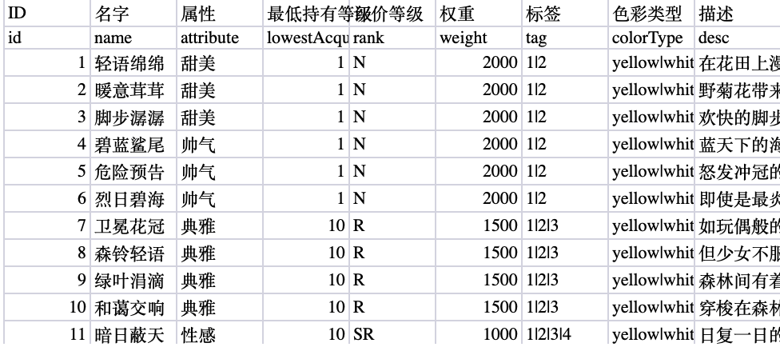
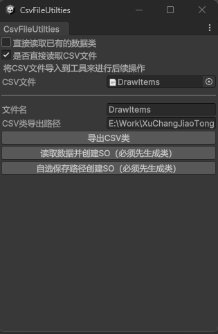
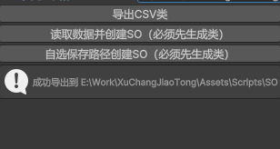
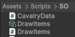
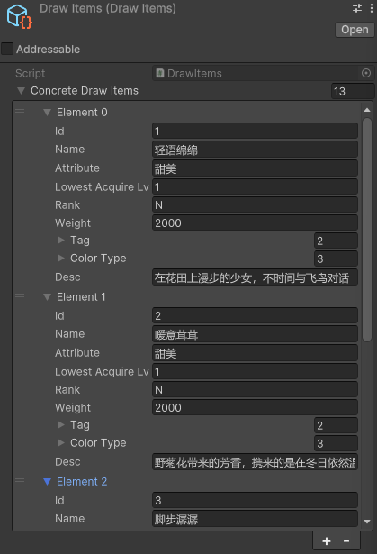

# Workflow Process

## Create Your Excel Configuration Table

First, the configuration table format is as follows:
1. The first row contains the names of each column, such as:

| ID | Name | Properties | Description |
| :-: | :-: | :-: | :-: |

2. The second row contains the names of the data in the script, such as:

| id | name | props | desc |
| :-: | :-: | :-: | :-: |

3. Starting from the third row, fill in the actual data according to the configured data format.

An overview of the table is shown below. This table is for reference only; configure it according to your actual requirements.



## Read and Separate Tables and Sheets

After configuring the table, we are ready to start reading the table and exporting it as a CSV file.

:::tip[Tip for Game Designers]
    For Sheets in the table that do not need to be exported, prefix them with `temp_`. Such Sheets will not be exported as actual data items.
:::

First, before exporting, confirm whether you have saved the Excel file. If not, **be sure to save it**!  
After saving, locate the `convert.py` script and run it:
```bash
python convertxlsx.py
```
If Python is not installed, you can download it from [Python.org](https://python.org).  
After confirming that all Excel files to be converted are in the same directory as the script, press Enter to start the conversion.

:::danger[Error Warning]
    Do not run the script while the Excel file is open, or it will definitely cause an error!  
    This is because an XLSX file creates a hidden temporary file for modifications, which is a temp file exclusive to the C drive. Reading this file will cause issues.
:::

The converted tables will be in the `converted_sheets` folder, and the console will display the following message:


Congratulations! You have completed the process of converting Excel tables to CSV.  
Next, we will start importing the CSV into Unity and perform data import operations in Unity.

## Process Converted CSV in Unity

Now, let's get to the main event! We will convert the CSV tables into usable data in Unity.  

### Why Use ScriptableObject (SO)?

ScriptableObject (SO) is a proprietary class supported by Unity. It can permanently store fixed data like JSON, while also allowing the addition of custom methods and parameters like a class. This makes it highly flexible.

Compared to JSON files, the advantages of SO are:
- More flexible format
- Can include custom methods or enums
- Functions like a normal class
- No need to decode from text
- Can directly store resources like Sprites

Disadvantages:
- Requires `Resource.Load()` or `File.Read()` operations to read the file
- Non-intuitive data modification, and data is saved in a non-textual format
- Highly restricted, limited to Unity usage

Therefore, it is necessary to balance the pros and cons to create a specific solution.  
Commonalities between SO and JSON:
- Both are data storage structures
- Small in size
- Cannot store dynamically changing data; they can only store fixed values or collections at a specific point in time after the data has been finalized

### Process the Converted CSV

First, ensure that the `CsvFileUtilities.cs` and `CsvHandler.cs` scripts are imported into your project.  
After importing, a new option named `CSV Utilities` will appear in the Windows menu at the top of Unity. Open **CSV Utilities**, and you will see the following window:


In this window, there are two options:
- Directly read an existing data class
- Whether to directly read a CSV file

If you check **Directly read CSV class**, the tool will use an existing class as the basis to create a data SO.This is typically useful when a class has multiple variants, such as skills that are not only divided into basic attacks and magical attacks but also into player skills and boss skills. These different objects can be distinguished in this way. (This is just an example; actual usage depends on your specific environment.)

The option **Whether to directly read CSV file**has two different behaviors depending on whether it is checked. If checked, you can directly drag and drop the CSV file into the editor window to read the table. If unchecked, the file will be searched using its absolute path.

**Why Use Absolute Path?**

Sometimes, game designers may not bundle the configuration table with the project but instead place it in a separate directory. In such cases, an absolute path is required.

:::warning[Note]
    File paths are assumed to be separated by **/** by default, if there's **\\** , change it to **/**.
:::

### Convert CSV to Class

After successfully importing the CSV (whether by dragging and dropping the file or entering the file path), several buttons will appear, indicating that the CSV file can be converted.



In the new page, you can see the following options:
- Export CSV class
- Read data and create SO
- Create SO with custom save path

Note that both "Read data and create SO" and "Create SO with custom save path" require creating a class first to work properly.  
After correctly dragging and dropping the file or entering the absolute path of the file, enter the name of the class to be created, then enter the project path where this class will be saved. This will create a brand new class in the specified project path. Based on this class, you can then proceed with the steps to create the data Asset.

The prompt after successfully creating a class is as follows:



If you close this tab but have already created the class, please refer to the section [Convert Existing Data Class to SO](#convert-existing-data-class-to-so) below.

### Convert Class to SO

Once the class is created, you can proceed to create the SO.

Creating an SO is straightforward. First, check if the file name is filled in. After filling in the SO save path (if you didn't close or modify the window after creating the class, you can use the existing configuration), you can choose to directly click ***Read data and create SO***, and the SO will appear in the folder!  
Alternatively, you can click ***Create SO with custom save path*** to choose your own save path for the SO.  
After export, the SO Asset file will appear in the folder, as shown below.  



### Convert Existing Data Class to SO

If you have already created a data class but want to create additional extended SO data based on this data class, you can check the ***Directly read existing data class*** option to enter the direct SO creation mode.  
Just like above, as long as you correctly enter the class name and save path, you can save successfully.

:::tip[Minor Defect and Future Improvements]
Due to insufficient early design, if you enter data inconsistent with the class name here, it may cause export failures. In the future, I will add the ability to read classes via drag-and-drop, followed by direct file name input.
:::

After exporting, you will see SO files with the same data as in the configuration table appear in the specified file directory!

